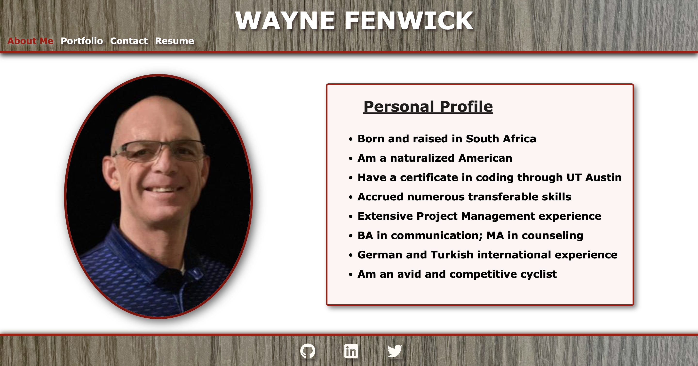
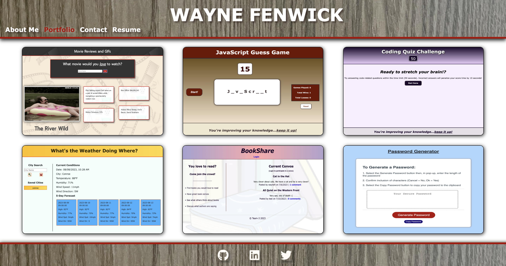

# 20-React-Portfolio

## License
&nbsp;

* Select the badge to see details.
* To see more about license badges, visit [Shields IO](https://shields.io/category/license)

&nbsp;

## Description
Potential employers are looking for candidates with experience building single-page applications. I created this portfolio using React. It contains a short Life experience Profile, application samples of work I have done up to this point, a contact form as well as a brief view of my proficiencies in coding along with an option to download my Resume.
&nbsp;

## Table of Contents

 * [Installation](#installation)
 * [Media](#media)
 * [Contribution](#contribution)
 

&nbsp;

## Installation

You’ll deploy this application to GitHub Pages. Follow the instructions in the Git Guide or consult the [Create React App Docs on GitHub Pages](https://create-react-app.dev/docs/deployment/#github-pages) to create a build that you can deploy.

**Important**: Be sure to push your codebase to the default branch in GitHub -- NOT your built and deployed code. Ensure this happens by using the `gh-pages` branch to host the deployed application's build.

&nbsp;

[Table of Contents](#table-of-contents)

## Media
_A brief overview of my Portfolio_
&nbsp;

&nbsp;

* Visit [Full Media Video](https://drive.google.com/file/d/1_XdsLhUysmf0ss8smtZCfNRNTKT_JprZ/view?usp=sharing) to see more details

&nbsp;

[Table of Contents](#table-of-contents)

## Questions

_If you have any questions, please feel free to contact me._

GitHub Username: [waynefenwick](https://github.com/waynefenwick)

Email Address: <a href="mailto:waynefenwick@gmail.com">waynefenwick@gmail.com</a>

&nbsp;

_Thanks for taking time to visit this repository!_

[Back to Top](#)

